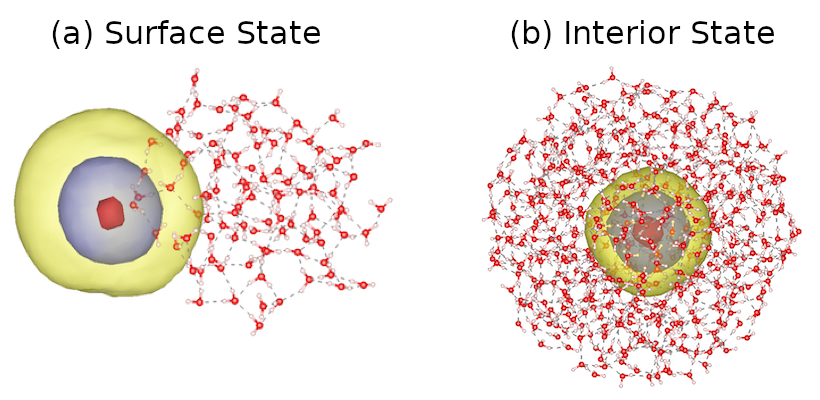
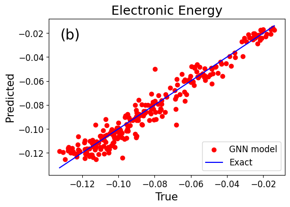
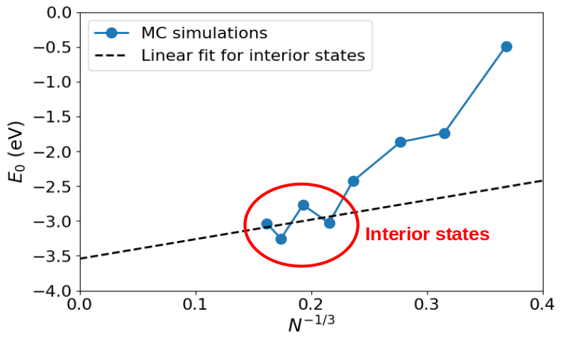

# Graph neural network based potential energy surfate to speed up Monte Carlo simulations of water cluster anions

This repository includes Python notebooks to build and train graph neural network models for prediction of the atomic and electronic energy components of water clusters anions, represented by the chemical formula $(\text{H}_2\text{O})^{-}_N$. The dataset includes molecular geometries generated by molecular dynamics simulations of clusters with sizes from 20 to 237 water molecules and temperatures between 50 and 200 Kelvins.

```math
E(\mathbf{r}_{1},\ldots,\mathbf{r}_{N})=V_{\mathrm{SPC/F}}(\mathbf{r}_{1},\ldots,\mathbf{r}_{N})+E_{0}(\mathbf{r}_{1},\ldots,\mathbf{r}_{N}).
```




In the context of molecular modeling, individual atoms are represented as nodes, while edges denote chemical bonds. Graph neural networks were implemented using the [Spektral library](https://graphneural.network). We identified the GATConv layer, incorporating an attention mechanism to dynamically weight the adjacency matrix, the optimal architecture to capture diverse node conections (O-H, O-H and H-H bonds) in different configurations.




The accurate and efficient energy model is employed to conduct Monte Carlo simulations across diferent sizes, demosntrating stable behaviour. The predicted surface-to-interior state transition point and the bulk energy of the system are consistent with previous investigations, at a computational cost three-orders of magnitude lower.

